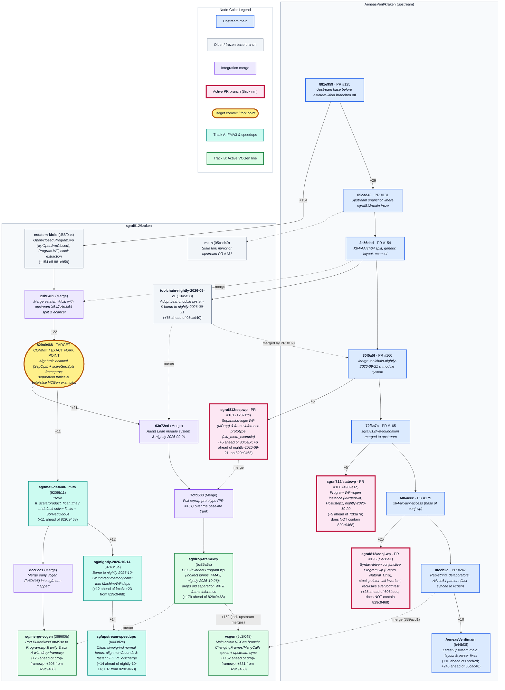

```mermaid
flowchart TD
    %% Upstream AeneasVerif/kraken main + upstream PR branches
    subgraph UPSTREAM["AeneasVerif/kraken (upstream)"]
        M_125["<b>881e959</b> · PR #125<br/><i>Upstream base before estatem-kfold branched off</i>"]
        M_131["<b>05cad40</b> · PR #131<br/><i>Upstream snapshot where sgraf812/main froze</i>"]
        M_154["<b>2c56cbd</b> · PR #154<br/><i>X64/AArch64 split, generic layout, ecancel</i>"]
        M_160["<b>30f5a5f</b> · PR #160<br/><i>Merge toolchain-nightly-2026-09-21 &amp; module system</i>"]
        M_165["<b>72f3a7a</b> · PR #165<br/><i>sgraf812/wp-foundation merged to upstream</i>"]
        M_179["<b>6064eec</b> · PR #179<br/><i>x64-fix-avx-access (base of conj-wp)</i>"]
        M_247["<b>0fccb2d</b> · PR #247<br/><i>Rep-string, delaborators, AArch64 parsers (last synced to vcgen)</i>"]
        M_HEAD["<b>AeneasVerif/main</b> (b44bf3f)<br/><i>Latest upstream main: layout &amp; parser fixes</i><br/>(+10 ahead of 0fccb2d; +245 ahead of 05cad40)"]

        PR_166["<b>sgraf812/statewp</b> · PR #166 (4989e1c)<br/><i>Program.WP vcgen instance (kvcgen64), Host/step1, nightly-2026-10-20</i><br/>(+5 ahead of 72f3a7a; does NOT contain 829c9468)"]
        PR_195["<b>sgraf812/conj-wp</b> · PR #195 (f5a85a1)<br/><i>Syntax-driven conjunctive Program.wp (StepIn, Natural, Until),</i><br/><i>stack-pointer call invariant, recursive even/odd test</i><br/>(+25 ahead of 6064eec; does NOT contain 829c9468)"]

        M_125 -->|"+29"| M_131
        M_131 --> M_154
        M_154 --> M_160
        M_160 --> M_165
        M_165 --> M_179
        M_179 --> M_247
        M_247 -->|"+10"| M_HEAD

        M_165 -->|"+5"| PR_166
        M_179 -->|"+25"| PR_195
    end

    %% sgraf812/kraken branches
    subgraph SGRAF["sgraf812/kraken"]
        SG_MAIN["<b>main</b> (05cad40)<br/><i>Stale fork mirror of upstream PR #131</i>"]
        EST["<b>estatem-kfold</b> (d68f0a4)<br/><i>Open/closed Program.wp (wpOpen/wpClosed), Program.WF, block extraction</i><br/>(+154 off 881e959)"]
        TN["<b>toolchain-nightly-2026-09-21</b> (1045c33)<br/><i>Adopt Lean module system &amp; bump to nightly-2026-09-21</i><br/>(+75 ahead of 05cad40)"]
        SEP["<b>sgraf812:sepwp</b> · PR #161 (12371fd)<br/><i>Separation-logic WP (MProp) &amp; frame inference prototype (alu_mem_example)</i><br/>(+5 ahead of 30f5a5f; +6 ahead of nightly-2026-09-21; no 829c9468)"]

        M_131 -.-> SG_MAIN
        M_125 -->|"+154"| EST
        M_154 --> TN
        TN -. "merged by PR #160" .-> M_160
        M_160 -->|"+5"| SEP

        %% Merge of estatem-kfold + upstream main
        M23B["<b>23b6409</b> (Merge)<br/><i>Merge estatem-kfold with upstream X64/AArch64 split &amp; ecancel</i>"]
        EST --> M23B
        M_154 -. merge .-> M23B

        %% THE TARGET COMMIT = EXACT FORK POINT
        C829(["<b>829c9468</b> · TARGET COMMIT / EXACT FORK POINT<br/><i>Algebraic ecancel (SepOps) + solveSepSplit frameproc;</i><br/><i>separation triples &amp; byte/slice VCGen examples</i>"])
        M23B -->|"+22"| C829

        %% Track A: FMA3 -> nightly-2026-10-14 -> upstream-speedups
        FMA3["<b>sg/fma3-default-limits</b> (9209b11)<br/><i>Prove ff_scalarproduct_float_fma3 at default solver limits + SbrNegOdd64</i><br/>(+11 ahead of 829c9468)"]
        N1014["<b>sg/nightly-2026-10-14</b> (9743c3a)<br/><i>Bump to nightly-2026-10-14; indirect memory calls; trim MachineWP deps</i><br/>(+12 ahead of fma3; +23 from 829c9468)"]
        SPEED["<b>sg/upstream-speedups</b> (a443d2c)<br/><i>Clean simp/grind normal forms, alignment/bounds &amp; faster CFG VC discharge</i><br/>(+14 ahead of nightly-10-14; +37 from 829c9468)"]

        C829 -->|"+11"| FMA3
        FMA3 -->|"+12"| N1014
        N1014 -->|"+14"| SPEED

        %% Track B: 63c72ed -> 7cfd503 -> sg/drop-framewp -> vcgen
        M63C["<b>63c72ed</b> (Merge)<br/><i>Adopt Lean module system &amp; nightly-2026-09-21</i>"]
        M7CF["<b>7cfd503</b> (Merge)<br/><i>Pull sepwp prototype (PR #161) over the baseline trunk</i>"]
        DROP["<b>sg/drop-framewp</b> (bc85a6a)<br/><i>CFG-invariant Program.wp (indirect jumps, FMA3, nightly-2026-10-26);</i><br/><i>drops old separation WP &amp; frame inference</i><br/>(+179 ahead of 829c9468)"]
        VCGEN["<b>vcgen</b> (6c2f048)<br/><i>Main active VCGen branch: ChangingFrames/ManyCalls specs + upstream sync</i><br/>(+152 ahead of drop-framewp; +331 from 829c9468)"]

        C829 -->|"+21"| M63C
        TN -. merge .-> M63C
        M63C --> M7CF
        SEP -. merge .-> M7CF
        M7CF --> DROP
        DROP -->|"+152 (incl. upstream merges)"| VCGEN
        M_247 -. "merge (339acd1)" .-> VCGEN

        %% sg/merge-vcgen combines Track A + early vcgen + drop-framewp
        DCC["<b>dcc8cc1</b> (Merge)<br/><i>Merge early vcgen (fe604b6) into sg/mem-mapped</i>"]
        MERGE_VC["<b>sg/merge-vcgen</b> (3696f0b)<br/><i>Port Butterflies/FmulSse to Program.wp &amp; unify Track A with drop-framewp</i><br/>(+26 ahead of drop-framewp; +205 from 829c9468)"]

        FMA3 --> DCC
        DCC --> MERGE_VC
        DROP -. merge .-> MERGE_VC
    end

    %% Legend
    subgraph LEGEND["Node Color Legend"]
        direction LR
        L1["Upstream main"]
        L2["Older / frozen base branch"]
        L3["Integration merge"]
        L_PR["Active PR branch (thick rim)"]
        L4(["Target commit / fork point"])
        L5["Track A: FMA3 &amp; speedups"]
        L6["Track B: Active VCGen line"]
    end

    %% Subgraph backgrounds (clean neutral canvas so node colors pop)
    style UPSTREAM fill:#f8fafc,stroke:#94a3b8,stroke-width:1.5px,color:#0f172a
    style SGRAF fill:#f8fafc,stroke:#94a3b8,stroke-width:1.5px,color:#0f172a
    style LEGEND fill:#ffffff,stroke:#cbd5e1,stroke-width:1px,color:#0f172a

    %% Node-type color classes
    classDef upstream fill:#dbeafe,stroke:#2563eb,stroke-width:2px,color:#0f172a
    classDef baseBranch fill:#f1f5f9,stroke:#64748b,stroke-width:1.5px,color:#0f172a
    classDef mergeNode fill:#ede9fe,stroke:#7c3aed,stroke-width:1.5px,color:#0f172a
    classDef activePR fill:#fce7f3,stroke:#be123c,stroke-width:4.5px,color:#0f172a
    classDef targetCommit fill:#fef08a,stroke:#b45309,stroke-width:4px,color:#0f172a
    classDef trackA fill:#ccfbf1,stroke:#0d9488,stroke-width:2px,color:#0f172a
    classDef trackB fill:#dcfce7,stroke:#15803d,stroke-width:2px,color:#0f172a

    class M_125,M_131,M_154,M_160,M_165,M_179,M_247,M_HEAD,L1 upstream
    class SG_MAIN,EST,TN,L2 baseBranch
    class M23B,M63C,M7CF,DCC,L3 mergeNode
    class PR_166,PR_195,SEP,L_PR activePR
    class C829,L4 targetCommit
    class FMA3,N1014,SPEED,L5 trackA
    class DROP,VCGEN,MERGE_VC,L6 trackB
```
